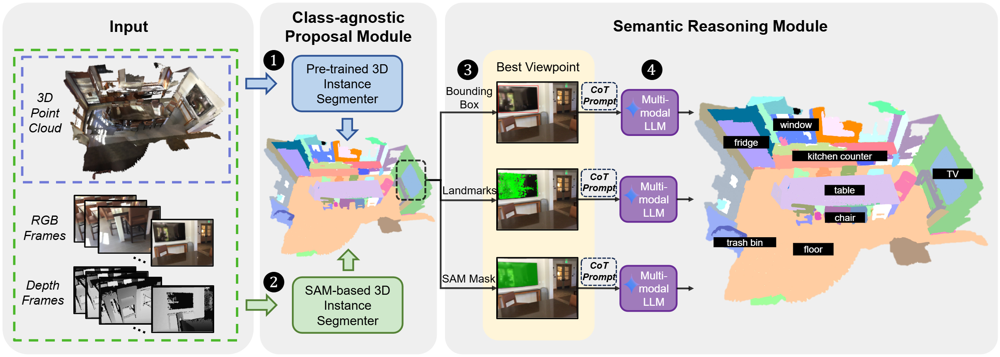

<p align="center">

  <h1 align="center">OV3D-CG: Open-vocabulary 3D Instance Segmentation with Contextual Guidance</h1>
  <p align="center">
    <a href="xxxxx">Mingquan Zhou</a><sup>1,2</sup>, 
    <a href="xxxxx">Chen He</a><sup>1,2</sup>
    <a href="xxxxx">Ruiping Wang</a><sup>1,2</sup>, 
    <a href="xxxxx">Xilin Chen</a><sup>1,2</sup>,
    <br>
    <sup>1</sup>Key Laboratory of AI Safety of Chinese Academy of Sciences (CAS),
Institute of Computing Technology, CAS, Beijing, 100190, China
    <br>
    <sup>2</sup>University of Chinese Academy of Sciences, Beijing, 100049, China
  </p>
  <h2 align="center">ICCV 2025</h2>
  <h3 align="center"><a href="https://openaccess.thecvf.com/content/ICCV2025/html/Zhou_OV3D-CG_Open-vocabulary_3D_Instance_Segmentation_with_Contextual_Guidance_ICCV_2025_paper.html">Paper</a> | <a href="https://vipl-vsu.github.io/OV3D-CG/">Project Page</a> </h3>
  <div align="center"></div>
<br>
<p align="center">
  <a href="">
    
  </a>
</p>

> **Abstract:** Open-vocabulary 3D instance segmentation (OV-3DIS), which aims to segment and classify objects beyond predefined categories, is a critical capability for embodied AI applications. Existing methods rely on pre-trained 2D foundation models, focusing on instance-level features while overlooking contextual relationships, limiting their ability to generalize to rare or ambiguous objects. To address these limitations, we propose an OV-3DIS framework guided by contextual information. First, we employ a Class-agnostic Proposal Module, integrating a pre-trained 3D segmentation model with a SAM-guided segmenter to extract robust 3D instance masks. Subsequently, we design a Semantic Reasoning Module, which selects the best viewpoint for each instance and constructs three 2D context-aware representations. The representations are processed using Multimodal Large Language Models with Chain-of-Thought prompting to enhance semantic inference. Notably, our method outperforms state-of-the-art methods on the ScanNet200 and Replica datasets, demonstrating superior open-vocabulary segmentation capabilities. Moreover, preliminary implementation in real-world scenarios verifies our method's robustness and accuracy, highlighting its potential for embodied AI tasks such as object-driven navigation.
---
## Installation

---

 ```bash
 git clone https://github.com/VIPL-VSU/OV3D-CG.git
 conda create -n ov3dcg python=3.10 -y
 conda activate ov3dcg
 cd OV3D-CG
 pip install -r requirements.txt
 ```

## Usage

---
### Step 1: Prepare the Dataset
We recommend to save the ScanNet data with the following structure.
```text
scene_XX/
      ├── pose                            <- folder with camera poses
      │      ├── 0.txt 
      │      ├── 1.txt 
      │      └── ...  
      ├── color                           <- folder with RGB images
      │      ├── 0.jpg (or .png/.jpeg)
      │      ├── 1.jpg (or .png/.jpeg)
      │      └── ...  
      ├── depth                           <- folder with depth images
      │      ├── 0.png (or .jpg/.jpeg)
      │      ├── 1.png (or .jpg/.jpeg)
      │      └── ...  
      ├── intrinsic                 
      │      └── intrinsic_color.txt       <- camera intrinsics
      └── scene_XX.ply                <- point cloud of the scene
```

### Step 2: Generate 3D Class-agnostic Masks
We employ two approaches to generate initial 3D class-agnostic instance masks. Please generate the masks following the instructions in their respective repositories and organize them as follows:

1. **Pretrained 3D Instances (Mask3D)**
   - Follow the instructions in [OpenMask3D](https://github.com/OpenMask3D/openmask3d) to generate masks.
   - **Output:** Place the generated masks in the `mask3d_masks` folder.

2. **SAM-based 3D Instances (SAI3D)**
   - Follow the instructions in [SAI3D](https://github.com/yd-yin/SAI3D) to generate masks.
   - The generated masks are in format 
   ```text
   demo_scannet_5view_merge200_2-norm_semantic-sam_depth2/
   ├──scene0011_00.txt
   ├──scene0011_00_pred_mask
       ├──scene0011_00_0.txt
       ├──scene0011_00_1.txt
       ├──...
   ├──scene0011_01.txt
   ├──scene0011_01_pred_mask
   ...
   ```
   - Use the provided script `sai3d_masks_to_tensor.py` to convert the .txt masks to .pt format. You should change the `mask_path_dir` and `split_txt_path` to your own path.
   - Run the script:
   ```bash
    python sai3d_masks_to_tensor.py
    ```
   - **Output:** The generated masks will be placed in the `sai3d_masks` folder.

### Step 3: Run OV3D-CG

1. **Top Views Selection**
- You should first modify the `config.json` to set the paths and parameters.
```text
gemini_api_key --> your Gemini API key
scannet_root --> path to the ScanNet root dataset
scene_list_file --> path to the scene list txt file
mask_3d_dir --> path to the Mask3D/SAI3D masks ("mask3d_masks" or "sai3d_masks")
mask_2d_save_dir --> path to save the 2D masks ("mask3d_masks_2d" or "sai3d_masks_2d")
sam_checkpoint --> path to the SAM checkpoint (PATH/sam_vit_h_4b8939.pth)
stride --> the stride to sample images from the scene
prompt_method --> "crop" or "bbox" or "circle" or "sam_mask"
```
- Run the top views selection script:
```bash
    python scene_mask_pipeline.py --config_path config.json
```

2. **Semantic Reasoning with Gemini**
- After obtaining the top views and context-aware representations, you can perform semantic reasoning using Gemini.
- Run the reasoning script:
```bash
    python semantic_module_pipline.py --config_path config.json
```
- The outputs will be saved in each scene folder in the `mask_2d_save_dir` folder.

### Step 4: Evaluation
- Finally, you can evaluate the results using the provided evaluation script.
- You should modify the `gt_dir` to your own path which is organized as
```text
gt/
      ├── scene0011_00.txt 
      └── scene0011_01.json
      └── ...
```
- Run the evaluation script:
```bash
    cd eval
    python eval_semantic_instance.py
```
- The evaluation results will be saved in file `scannet200_res.txt`.

## Citation

---
```text
@inproceedings{zhou2025ov3d,
  title={OV3D-CG: Open-vocabulary 3D Instance Segmentation with Contextual Guidance},
  author={Zhou, Mingquan and He, Chen and Wang, Ruiping and Chen, Xilin},
  booktitle={Proceedings of the IEEE/CVF International Conference on Computer Vision},
  pages={5305--5314},
  year={2025}
}
```