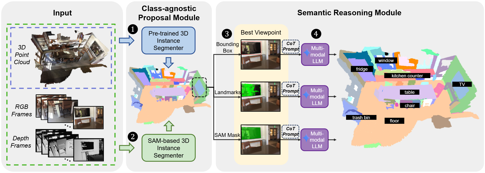

  <h1 align="center">OV3D-CG: Open-Vocabulary 3D Instance Segmentation</h1>
  

    <a href="xxxxx">Mingquan Zhou</a>1,2, 
    <a href="xxxxx">Chen He</a>1,2
    <a href="xxxxx">Ruiping Wang</a>1,2, 
    <a href="xxxxx">Xilin Chen</a>1,2,
     
    1Key Laboratory of AI Safety of Chinese Academy of Sciences (CAS),
Institute of Computing Technology, CAS, Beijing, 100190, China
     
    2University of Chinese Academy of Sciences, Beijing, 100049, China
  

  <h2 align="center">ICCV 2025</h2>
  <h3 align="center"><a href="https://arxiv.org/">Paper</a> | <a href="https://vipl-vsu.github.io/OV3D-CG/">Project Page</a> </h3>
  

 

  

> **Abstract:** We introduce Open3DIS, a novel solution designed to tackle the problem of Open-Vocabulary Instance Segmentation within 3D scenes. Objects within 3D environments exhibit diverse shapes, scales, and colors, making precise instance-level identification a challenging task. Recent advancements in Open-Vocabulary scene understanding have made significant strides in this area by employing class-agnostic 3D instance proposal networks for object localization and learning queryable features for each 3D mask. While these methods produce high-quality instance proposals, they struggle with identifying small-scale and geometrically ambiguous objects. The key idea of our method is a new module that aggregates 2D instance masks across frames and maps them to geometrically coherent point cloud regions as high-quality object proposals addressing the above limitations. These are then combined with 3D class-agnostic instance proposals to include a wide range of objects in the real world. To validate our approach, we conducted experiments on three prominent datasets, including ScanNet200, S3DIS, and Replica, demonstrating significant performance gains in segmenting objects with diverse categories over the state-of-the-art approaches.

 

---
## Code
Upcoming Soon...

